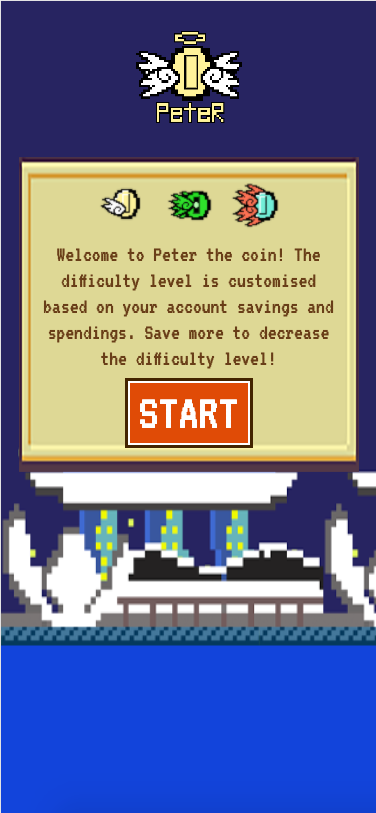
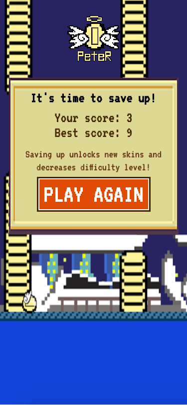

# Peter the Coin

A simple game to encourage financial discipline. We retrieve the player's transactions through the Mambu API.

## Custom Skins

## Game Screenshots

## Calculating Difficulty

We use the player's past 5 transactions' simple moving average to determine the trend of the account balance. We average the distances of the last 3 balances from their respective SMA5 and feed that number into a squashing function to scale the difficulty for each individual player appropriately.

By Zhe Quan, [Tshuen Hau](https://github.com/tshuenhau) and [Kevin](https://github.com/19hours)
